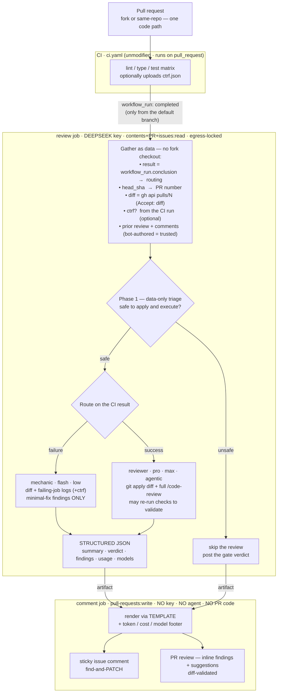

# AI Code Review Without a Black Box — design & roadmap

> **Origin & scope.** These are the design notes from the **camas** prototype (see
> [HANDOFF.md](../HANDOFF.md)) and they reference camas throughout. The provider- and tool-agnostic
> *normative* spec is being extracted into `SPEC.md`; treat camas and DeepSeek here as the reference
> example, **not** requirements. camas: <https://github.com/JPHutchins/camas>.
>
> The project is named `code-review`. Claude Code, DeepSeek, camas, and OpenCode are named
> nominatively — the tools an adapter targets — and no affiliation or endorsement is implied.

Status: **v1 shipped and proven** (PR [#17](https://github.com/JPHutchins/camas/pull/17#issuecomment-4859543691)
got a sticky review comment; the harden-runner egress log shows the exact containment we designed —
DeepSeek + pypi/uv + github only, armour engaged). This doc is the design for **v2** and the seed
for a blog post.

---

## Thesis: the advantage is that there is *no* Action

There is no marketplace Action here, no hosted GitHub App, no third-party SaaS reviewer
(CodeRabbit / Greptile / Copilot / the Claude GitHub App). The whole system is:

- **workflow YAML you can read top to bottom**, reviewed in the same PR flow as the code it guards,
- a headless `claude -p` invocation (any Anthropic-compatible CLI), and
- `gh api` to post the result.

That is the product. The advantages are not incidental — they *fall out* of there being no Action:

| Because there's no Action… | You get |
| --- | --- |
| The backend is `ANTHROPIC_BASE_URL` + a model env | **Model-agnostic** — DeepSeek today, anything Anthropic-compatible tomorrow, no vendor lock |
| The prompt, schema, and gate live in the repo | **Transparent & auditable** — nothing hidden in a vendor's servers |
| You choose token scopes / egress / spend cap | **You own the security boundary**, not a vendor's defaults |
| The orchestration is just a CLI call | **Portable** — the GitHub-specific part is a thin posting adapter |

### Universal core vs the camas layer

Keep these two separate — it's what makes the technique portable *and* gives camas a clean upsell:

- **Universal core (works in any repo):** CI already ran the whole pipeline before the reviewer
  spends a token. **Route the review on the native GitHub Actions result** — a deep review on green,
  a fast mechanical-fix pass on red. The signal is `workflow_run.conclusion`; it needs no special
  tooling and every repo already has it.
- **camas layer (optional enrichment):** camas reproduces CI locally and — via the
  [Ctrf effect](https://github.com/JPHutchins/camas/blob/main/src/camas/effect/ctrf.py) — can emit a
  machine-readable per-test report. When present it hands the agent structured detail (which tests,
  messages, timing) instead of raw job logs; and (Phase E) the whole review collapses into
  `camas run review`, identical locally and in CI.

> Your CI already ran everything and knows the result. **Route on that** instead of paying a
> max-effort agent to rediscover it — and if your runner emits CTRF, hand that over too.

CTRF must **never be a requirement**. The article advertises camas, but the core has to work for a
reader whose repo has never heard of it.

---

## Where v1 is today

```
PR ─▶ claude-code-review-collect.yaml   (unprivileged: no secrets, contents:read)
        └─ git diff base...HEAD → pr.diff   (uploads artifact; posts nothing)
                     │  workflow_run  (privileged, fires only from default branch)
                     ▼
      claude-code-review.yaml
        review  job (DEEPSEEK key, contents:read, egress-locked by harden-runner)
          phase 1  data-only triage of pr.diff  → {safe, reasons}   (heuristic first filter)
          phase 2  if safe: git apply + `claude -p "/code-review"` (agentic, bypassPermissions)
                   → out.md
        comment job (pull-requests:write, NO key, NO agent, NO PR code)
          → sticky issue comment (marker <!-- claude-code-review -->, find-and-PATCH)
```

Security boundary that actually holds (triage is only a first filter): read-only token on the agent
job + harden-runner egress lock + a **burner `DEEPSEEK_API_KEY` with a hard spend cap**. Residual
exfil channel is the public comment/log — which is why the spend cap, not the gate, is the backstop.

v2 keeps this boundary. The main structural change is the trigger and the routing (below); everything
else is additive.

---

## v2 target data flow



Two files total: `ci.yaml` (unchanged) and `review.yaml` (privileged, two jobs). The collector is
**dropped** — triggering off CI gives the routing signal for free, and the diff is fetched as data via
the API, so nothing is lost. The `review` / `comment` split (separate token scopes) is the security
boundary, so both live in the one privileged file.

---

## Design 1 — structured output the commenter parses (goals 2 & 3)

Stop having the agent hand-format a comment. Give the reviewer a `--json-schema` so its result lands
in `.structured_output`, and let the **commenter own presentation** (data → template, never
model-authored markup near a shell). The canonical schema is [`schema/findings.schema.json`](../schema/findings.schema.json):

```jsonc
// review findings schema (passed to `claude -p --json-schema '…'`)
{
  "type": "object",
  "required": ["summary", "verdict", "findings"],
  "additionalProperties": false,
  "properties": {
    "summary":  { "type": "string" },                       // markdown walkthrough
    "verdict":  { "enum": ["approve", "comment", "changes"] },
    "findings": {
      "type": "array",
      "items": {
        "type": "object",
        "required": ["path", "start_line", "end_line", "severity", "title", "body"],
        "additionalProperties": false,
        "properties": {
          "path":       { "type": "string" },
          "start_line": { "type": "integer" },
          "end_line":   { "type": "integer" },
          "side":       { "enum": ["RIGHT", "LEFT"] },       // RIGHT = added/changed line
          "severity":   { "enum": ["critical", "major", "minor", "nit"] },
          "title":      { "type": "string" },
          "body":       { "type": "string" },                // markdown
          "suggestion": { "type": ["string", "null"] },      // exact replacement for start_line..end_line
          "confidence": { "type": "number" }                 // 0..1, for noise suppression
        }
      }
    }
  }
}
```

The commenter maps this to **two GitHub surfaces**:

1. **Overall** → the existing sticky issue comment (editable, find-and-PATCH). Carries `summary`,
   the test-results panel, and the usage/cost footer.
2. **Inline** → one **pull request review**:
   `POST /repos/{owner}/{repo}/pulls/{n}/reviews` with a `comments[]` array. Suggestions are a
   fenced `suggestion` block appended to a comment `body`.

### Inline-comment gotchas (each of these will bite; design for them)

- **Inline comments only attach to lines in the diff.** A finding on an out-of-diff line makes the
  reviews API reject the *entire* review with 422. The commenter has the diff, so it must
  **validate each finding's line against the diff hunks** and demote non-diff findings into the
  summary body instead of dropping the review.
- **Use the modern absolute `line` + `side`** (`RIGHT` for additions), plus `start_line` +
  `start_side` for multi-line. Do **not** use the deprecated `position` (diff-offset) field.
- **`commit_id` must be the reviewed head SHA** — use the trusted `workflow_run.head_sha`.
- **A suggestion block replaces exactly the `start_line..end_line` range** it's attached to; the
  agent must size the range to the replacement.
- **Reviews aren't editable like comments; re-runs stack.** Strategy: keep the **summary** as the
  editable sticky comment; post a **fresh review per head SHA** and dismiss/minimize the previous
  bot review on that PR. (Alternative: dedup findings against the last run — more code, less noise.)
- **`event` mapping:** post as `COMMENT`, never `REQUEST_CHANGES`. The review is advisory and must
  **never block merge** via branch protection. Surface `verdict` as a badge in the body instead.

### Injection-safety extends to the reviews payload

The findings text is untrusted (it reviews the PR's own code). The `jq -n --rawfile` discipline from
v1 must cover the **whole reviews payload** — build `comments[]` with `jq` from the parsed JSON,
never string-concatenate model output into the request or the shell.

---

## Design 2 — route the review on the CI result (goal 4, made portable)

The routing signal is the **native GitHub Actions outcome**, which every repo has — *not* CTRF.
Trigger the privileged review off the **CI workflow completing**, so the result arrives for free and
CI is guaranteed to have finished before a token is spent (this is the ordering the original "it
already ran" idea needed — with no polling):

```yaml
on:
  workflow_run:
    workflows: ["CI"]        # your existing lint/type/test workflow, by its `name:` — unmodified
    types: [completed]
```

For camas that's literally `name: CI`, which already runs on `pull_request` — so **zero changes to
`ci.yaml`**. `workflow_run.conclusion` is the aggregate of the whole matrix (success only if every
job passed), which is exactly the gate we want.

Route on the conclusion:

| `workflow_run.conclusion` | Route | Model / effort | Context fed to the agent |
| --- | --- | --- | --- |
| `success` | **reviewer** | pro, max, agentic | diff (+ CTRF if present); full `/code-review`; may re-run checks to validate a finding |
| `failure` | **mechanic** | flash, low | diff + **failing-job logs** (universal) [+ CTRF]; **minimal-fix findings only — no comprehensive review** |

Both paths emit the same findings schema, so the commenter stays route-agnostic. The rationale is the
one from the original idea — deep-reviewing red code is premature and wasteful — but the *gate* is now
the portable Actions result, not a camas artifact.

**Failure detail without camas (universal):**
`gh api repos/{repo}/actions/runs/{run_id}/jobs` → the failed jobs → `gh api .../jobs/{job_id}/logs`.
Hand the failing step logs to the mechanic. Works in any repo, no special tooling.

**CTRF as optional enrichment (the camas layer):** if the CI run uploaded a CTRF artifact, download it
and give the agent structured per-test detail (which tests failed, messages, timings) instead of raw
logs — sharper mechanic fixes and richer green-path evidence. Absent CTRF, the logs path above covers
it. This is the camas upsell with **no hard dependency**. Wiring it in is opt-in: a `camas` task that
emits CTRF via the [Ctrf effect](https://github.com/JPHutchins/camas/blob/main/src/camas/effect/ctrf.py)
+ one `upload-artifact` step in CI.

**Getting the diff:** the review needs the diff as data, with no fork checkout. Recommended:
`gh api repos/{repo}/pulls/{N} -H 'Accept: application/vnd.github.v3.diff'` (N from the trusted
head_sha) — pure REST, executes nothing; fall back to a bare `git fetch` + `git diff` for very large
diffs the API truncates. The v1 unprivileged collector is dropped (see Open Decisions).

**Everything from the PR is untrusted** — diff, logs, and CTRF all describe or are produced by PR
code. Triage them, never shell-interpolate, treat each as a prompt-injection surface (Design 1's
`jq --rawfile` discipline applies to every one).

---

## Design 3 — token usage, USD cost, model IDs incl. subagents (goals 5, 6, 7)

Capture the **full** `claude -p --output-format json` envelope, not just `.result`/`.structured_output`.
Representative shape (**verify against CLI 2.1.197 — capture one real envelope and pin the parser to
its exact keys**):

```jsonc
{
  "type": "result",
  "subtype": "success",
  "is_error": false,
  "duration_ms": 91234,
  "num_turns": 7,
  "total_cost_usd": 0.0,          // computed from ANTHROPIC's price table → NOT DeepSeek's. Recompute.
  "usage": {
    "input_tokens": 0, "output_tokens": 0,
    "cache_read_input_tokens": 0, "cache_creation_input_tokens": 0
  },
  "modelUsage": {                 // per-model breakdown; SUBAGENT models appear as their own keys
    "deepseek-v4-pro":   { "inputTokens": 0, "outputTokens": 0, "cacheReadInputTokens": 0, "costUSD": 0 },
    "deepseek-v4-flash": { "inputTokens": 0, "outputTokens": 0, "cacheReadInputTokens": 0, "costUSD": 0 }
  },
  "structured_output": { /* the findings schema above */ },
  "result": "…"
}
```

- **Model IDs incl. subagents (goal 7):** the keys of `modelUsage`. The main model comes from
  `ANTHROPIC_MODEL`; subagents from `CLAUDE_CODE_SUBAGENT_MODEL` — both show up as distinct keys.
- **USD cost (goal 6):** `total_cost_usd` is priced against Anthropic, so it will **not** reflect
  DeepSeek. Keep a small, date-stamped **price map** and recompute:
  `cost = Σ_model (in·price_in + out·price_out + cache_read·price_cache_read) / 1e6`.

```jsonc
// schema/prices.example.json — commit so a reader can see & fork it; PRICES DRIFT, so date-stamp it
{
  "_updated": "2026-07-01",
  "_unit": "USD per 1M tokens",
  "deepseek-v4-pro":   { "in": 0.00, "out": 0.00, "cache_read": 0.00 },
  "deepseek-v4-flash": { "in": 0.00, "out": 0.00, "cache_read": 0.00 }
}
```

- **Token usage (goal 5):** render `modelUsage` as a table in the footer, input/output/cache per model
  plus totals.

### Report footer (rendered by the commenter)

```
| Model               | Input | Output | Cache read | Cost   |
|---------------------|------:|-------:|-----------:|-------:|
| deepseek-v4-pro     |  …    |  …     |  …         | $…     |
| deepseek-v4-flash   |  …    |  …     |  …         | $…     |
| **Total**           |  …    |  …     |  …         | **$…** |

Route: full review (all green) · effort: max · turns: 7 · wall: 91s
```

Then the **LLM Disclosure** aside — on-theme *and* it satisfies the repo's own disclosure convention
automatically, naming the exact model(s) from `modelUsage`.

---

## Design 4 — the posting template (goal 1)

The agent emits **data**; the commenter renders **presentation**. Benefits: one consistent style,
injection-safe (data → template, never model-authored HTML/shell), restyle without touching prompts.

**Where the template lives** — recommend a small tested renderer (part of the helper package, or a
task-runner effect) rather than a bash heredoc. Keeping the template as tested code, not prose, is
SSOT-clean and lets the same comment render locally.

Template structure (what the good tools in the wild converge on):

- H3 title + **verdict badge** + one-line **route** ("full review — all green" / "fast fix — 3 failing").
- One-paragraph **walkthrough** (what changed, why).
- **Findings grouped by severity**; critical/major expanded, **nits folded** in `<details>` so the
  top of the comment is only high-signal.
- Per finding: `file:line` link · body · optional `suggestion` block.
- Collapsible **test-results panel**: pass/fail counts, newly-failing, slowest (from CTRF if present,
  else the failed-job summary).
- **Footer**: model/token/cost table + duration + effort + disclosure.
- Hidden markers: sticky `<!-- code-review -->` **and** `<!-- reviewed-sha: … -->` (enables
  incremental review — see nice-to-haves).

A sample rendered comment lives in [`examples/templates/comment.example.md`](../examples/templates/comment.example.md).

---

## Design 5 — feed the PR conversation & the previous review (context, not access)

The agent has **no GitHub access**, and shouldn't — egress is locked and it holds no token. So the
*workflow* fetches the conversation as **data files** (exactly like the diff) and hands them in. That
keeps the boundary intact and unlocks the most useful context there is: **what the reviewer already
said.**

**What to feed:**

- **The previous review** — the last sticky summary + the last inline review. The agent can then run a
  true *incremental* pass: skip what's already flagged, mark findings still-open vs resolved, and not
  repeat itself. Paired with the `<!-- reviewed-sha: … -->` marker it also knows which commits are new
  (`git diff <reviewed-sha>..<head>`), so tokens go to the delta.
- **Author replies to inline comments** — "done" / "won't fix" / "disagree". Respect resolutions
  instead of re-nagging. (REST returns the comments; **resolved-thread state needs GraphQL**
  `reviewThreads { isResolved }` — worth it for the polished version.)
- **PR title & body** — author intent; lets the review judge whether the change does what it claims.
- **Maintainer conversation** — scope guidance, linked issues.

**Trust — the one thing to get right.** PR body and comments are **fork-controlled** (anyone can write
anything), so the whole bundle is a prompt-injection surface: pass as files, never shell-interpolate,
and run it through the same phase-1 triage. The subtle trap is the *previous review* — do **not** trust
it just because it carries our `<!-- code-review -->` marker; a fork author can paste that marker
into their own comment. **Trust it only when the comment's author is the bot identity your `comment` job
posts as** (`github-actions[bot]`, or your App's login) — an identity a fork cannot spoof. Author
association (`OWNER`/`MEMBER` vs `CONTRIBUTOR`/`NONE`) further separates maintainer guidance from
drive-by text; useful as signal, but even maintainer text must never override the security posture.

**Fetch, don't grant.** A pre-agent step in the review job reads the conversation with the read-only
token and writes `context.json`; the agent only ever reads that file. Add `pull-requests: read` +
`issues: read` to the review job — still no write, and the agent never holds the token. Endpoints:
`GET issues/{N}/comments`, `GET pulls/{N}` (title/body), `GET pulls/{N}/reviews` + `/comments`
(filtered to the bot author). Allow `api.github.com` in the egress list for this step (block mode needs
it for artifact download anyway).

---

## Nice-to-haves seen in the wild (prioritized)

| Feature | Value | Effort | Notes |
| --- | --- | --- | --- |
| Sticky summary comment | high | — | **have** (find-and-PATCH) |
| Inline comments + suggestions | high | med | Design 1 |
| CI-result routing (red/green) | high | med | Design 2 — native & portable; CTRF optional |
| Token/cost/model footer | high | low | Design 3 |
| Severity folding (`<details>` nits) | high | low | noise control — the #1 complaint about AI review |
| Confidence score + suppress low | high | low | schema has `confidence`; drop < threshold |
| Incremental review (delta since `reviewed-sha`) | high | med | store last SHA in marker; only review new commits → big token save on pushes |
| Never block merge (advisory) | high | — | `COMMENT` event, non-required check, always exit 0 |
| Spend cap / token budget | high | med | ties to camas `--under` budget scheduler (issue #54); abort if projected cost > ceiling |
| `concurrency:` cancel on force-push | med | low | don't pay for superseded runs |
| Path / label filters (`skip-review`, docs-only) | med | low | cheap way to cut cost/noise |
| Skip bot/dependabot PRs (or light pass) | med | low | — |
| Resolve/minimize outdated inline comments | med | med | re-run hygiene |
| Acknowledge author replies / resolved threads | high | med | feed prior review + replies (Design 5); don't re-nag resolved items — GraphQL `isResolved` |
| `@mention` commands (re-review / explain / resolve) | med | high | needs an `issue_comment`-triggered workflow |
| Walkthrough + mermaid for control-flow changes | med | med | GFM renders mermaid; CodeRabbit-style |
| Diff-size-based model routing | med | low | tiny diff → flash; large/critical → pro |

---

## Open decisions (with a recommendation)

1. **Orchestrator: bespoke YAML vs a task-runner task.** → *Make the review a task* (camas task, or the
   generic equivalent). It runs identically locally and in CI; GitHub becomes a thin posting adapter.
   This is the truest "no Action". YAML stays as the trigger + secret/egress boundary only.
2. **Routing signal.** → *Resolved: native `workflow_run.conclusion`, triggering off the CI workflow.*
   CTRF and job logs are enrichment, never the gate — this is what keeps the technique portable.
3. **Collector — DECIDED: dropped.** Triggering off CI + fetching the diff via the API makes it
   redundant, leaving just `ci.yaml` (unchanged) + `review.yaml` (privileged, two jobs). Fetching the
   diff *text* via REST executes nothing, so the boundary (read-only token + egress lock + burner
   spend cap, diff applied only post-triage) is unchanged. The only thing given up is the
   defense-in-depth framing that the privileged job's sole inputs were the trusted base + one inert
   artifact — judged not worth an extra file. (Reverses the merged v1 collector.)
4. **Inline delivery: reviews API vs individual comments.** → *Reviews API*, with diff-validation and
   fail-open to the summary body for out-of-diff findings.
5. **Price-map SSOT + drift.** → *Committed `schema/prices.example.json`, date-stamped*; readers fork it.
6. **Incremental vs full each run.** → *Incremental* via the `reviewed-sha` marker once inline works.
7. **Multi-review stacking.** → *Sticky summary comment + fresh review per head SHA*, dismiss prior
   bot review.

---

## Security deltas from v1

- **Trigger moves to CI completion.** CI is the existing unprivileged `pull_request` workflow;
  triggering the privileged review off it is the same "pwn request" pattern, and `head_sha` /
  `conclusion` come from the trusted `workflow_run` event, never from PR-controlled content.
- **Diff via REST executes nothing.** With the collector dropped, the review fetches the diff with
  `gh api … Accept: diff` — data only; fork code is still applied and executed **only** in phase 2,
  post-triage, under the egress lock. The boundary is unchanged from v1.
- **Diff, job logs, and CTRF are all untrusted** → triage, never shell-interpolate, injection
  surface; `jq --rawfile` for every payload, including the reviews `comments[]`.
- **PR body & comments are fork-controlled** → same untrusted/injection treatment. The *previous*
  review is trusted only because it's filtered by **author identity** (the bot login), which a fork
  cannot spoof — never by the marker alone. The review job gains `pull-requests: read` + `issues: read`
  (still no write; the agent never holds the token — a pre-agent step fetches to a file). See Design 5.
- **Unchanged backstop:** read-only agent token + egress lock + burner key with a hard spend cap. The
  residual exfil channel is still the public comment; the spend cap is the real limit on abuse.

---

## Roadmap (each phase is independently shippable)

- **Phase A — structured + template.** Reviewer switches to `--json-schema`; add the template
  renderer; footer with usage/cost/models. No new triggers. *(Delivers goals 1, 5, 6, 7.)*
- **Phase B — inline + suggestions.** Commenter posts a diff-validated PR review with inline comments
  and suggestions, keeping the sticky summary. *(Delivers goal 3, finishes goal 2.)*
- **Phase C — CI-result routing (portable).** Trigger the review off CI completion; route on
  `workflow_run.conclusion` (green→reviewer, red→mechanic-from-logs). *Optional camas enrichment:*
  wire CTRF into CI and feed it when present. *(Delivers goal 4, portably.)*
- **Phase D — memory & noise.** Feed the previous review + author replies (Design 5) for incremental
  review that doesn't re-nag resolved items; severity folding, confidence suppression, `concurrency`
  cancel, spend cap (camas #54), skip-labels.
- **Phase E — portability.** Extract orchestration into a task-runner task; GitHub becomes a thin
  adapter; the review runs locally too. *(Delivers the thesis.)*
